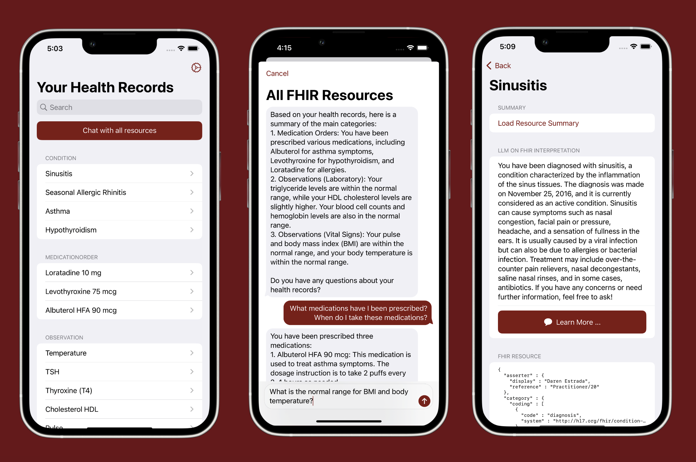
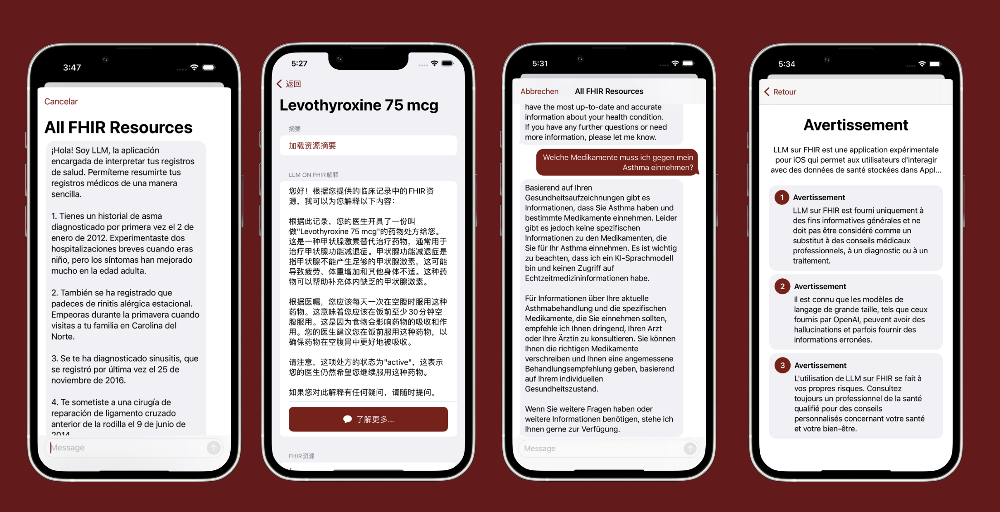

<!--

This source file is part of the Stanford LLM on FHIR project

SPDX-FileCopyrightText: 2023 Stanford University

SPDX-License-Identifier: MIT

-->

# LLM on FHIR - Demystifying Health Records

[](https://github.com/PSchmiedmayer/LLMonFHIR/actions/workflows/beta-deployment.yml)
[](https://codecov.io/gh/StanfordBDHG/LLMonFHIR)
[](https://doi.org/10.5281/zenodo.7959850)

*"Demystifying Health Records - A Conversational Interface to Your Health Data"*

<p float="left">
 
</p>

This repository contains the LLM on FHIR Application to demonstrate the power of LLMs to explain and provide helpful context around patient data provided in the FHIR format.
It demonstrates using the [Spezi](https://github.com/StanfordSpezi/Spezi) framework and builds on top of the [Stanford Spezi Template Application](https://github.com/StanfordSpezi/SpeziTemplateApplication). The application connects to the OpenAI GPT API to interpret FHIR resources using the GPT suite of large language models.

<p float="left">
 
</p>

LLMonFHIR supports multiple languages. The LLM is prompt-engineered to converse with users based on their system language. The application is currently translated into English, Spanish, Chinese, German, and French.

> [!NOTE] 
> Do you want to try out the LLM on FHIR Application? You can download it to your iOS device using [TestFlight](https://testflight.apple.com/join/HBFZ5WOn)!

## Overview

- **Inspect Your Health Data:** Our application connects with the Apple Health app via the FHIR (Fast Healthcare Interoperability Resources) patient data API, allowing you to view your health data conveniently.

- **Summarize & Interpret Your Data:** The app uses OpenAI's sophisticated large language model (LLM) to interpret and summarize complex health records, presenting them in a user-friendly, understandable manner.

- **Learn More About Your Data:** You can utilize the chat functionality for follow-up questions, enabling a deeper understanding of your health records.


## Disclaimer

LLM on FHIR is an experimental iOS app. It is designed for general informational purposes, providing users a platform to interact with health records stored in Apple Health using OpenAI models.

- **Not a Substitute for Professional Advice:** LLM on FHIR is not intended as a substitute for professional medical advice, diagnosis, or treatment.

- **Limitations of AI Models:** Remember, AI models can sometimes make mistakes or generate misleading information. Always cross-check and verify the information provided.

- **Use at Your Own Risk:** Any use of LLM on FHIR is at the user's own risk. Always consult a qualified healthcare provider for personalized advice regarding your health and well-being.

- **Demonstration Only:** This app is intended for demonstration only and should not be used to process any personal health information.

Remember that your health data will be sent to OpenAI for processing.
Please inspect and carefully read the [OpenAI API data usage policies and settings](https://openai.com/policies/api-data-usage-policies) accordingly.


## HealthKit Access

LLM on FHIR requires access to the FHIR health records stored in the Apple Health app. You have the control to select the different types of health records you wish to inspect in LLM on FHIR.

In case no health records are available, please follow the instructions to connect and retrieve your health records from your provider. If your health records are visible in the Apple Health app, please ensure that LLM on FHIR has access to your health records in the Apple Health App. You can find these settings in the privacy section of your profile in Apple Health.

> [!TIP]
> You can also use a set of [Synthea](https://doi.org/10.1093/jamia/ocx079)-based patients loaded from [SpeziFHIR](https://github.com/StanfordSpezi/SpeziFHIR) ([SpeziFHIRMockPatients](https://github.com/StanfordSpezi/SpeziFHIR/tree/main/Sources/SpeziFHIRMockPatients)) to test out the application without the need to connect it to HealthKit. You can select the synthetic patients in the account settings view of the application.

## Application Structure

The Spezi Template Application uses a modularized structure using the [Spezi modules](https://swiftpackageindex.com/StanfordSpezi) enabled by the Swift Package Manager.

The application uses the FHIR standard to provide a shared repository for data exchanged between different modules.
You can learn more about the Spezi standards-based software architecture in the [Spezi documentation](https://github.com/StanfordSpezi/Spezi).


## Build and Run the Application

You can build and run the application using [Xcode](https://developer.apple.com/xcode/) by opening up the **LLMonFHIR.xcodeproj**.

When running LLMonFHIR via Xcode, you can use the `--mode` CLI flag to control the behaviour of the app (configurable via the Run scheme):
- `--mode standalone` performs a regular launch, where LLMonFHIR can be used with a custom OpenAI API key to use the chat mode;
- `--mode study <study-id>` launches LLMonFHIR into its study mode, loads the study with the specified id from the UserStudyConfig.plist file, and automatically opens it;
- `--mode study` launches LLMonFHIR into its study mode, showing a "Scan QR Code" button to select and open a study.


### Study Report File Encryption

The report files generated form the usability study are optionally encrypted, using the public key stored in `UserStudyConfig.plist.

You can generate a public/private key pair using the following commands:
```bash
# generate private key
openssl genpkey -algorithm X25519 -out private_key.pem

# extract public key
openssl pkey -in private_key.pem -pubout -out public_key.pem
```

Run the following command to place your public key in the user study config file:
```bash
plutil -replace ENCRYPTION_KEY -data $(cat public_key.pem | base64) LLMonFHIR/Supporting\ Files/UserStudyConfig.plist
```

In order to decrypt a report file created by the app, you can use the python tool in `tools/decrypt-study-report`:
```bash
uv run main.py -k private_key.pem <input file>
```


## Network-local privacy-focused Fog LLM Mode

LLMonFHIR can run LLM inference for resource summarization and interpretation on nearby machines in your local network, called fog nodes, instead of only on-device or in the cloud.
The app discovers a fog node via mDNS, connects to it, and streams model responses back while dispatching inference tasks.
This setup provides low latency, strong performance, and improved privacy, since models run on your own hardware inside your own network.

For instructions on running a minimal Docker-based fog node on Linux or macOS, see [FogNode/README.md](FogNode/README.md).


## Contributors & License

This project is based on [Spezi](https://github.com/StanfordSpezi/Spezi) framework and builds on top of the [Stanford Spezi Template Application](https://github.com/StanfordSpezi/SpeziTemplateApplication) provided using the MIT license.
You can find a list of contributors in the `CONTRIBUTORS.md` file.

The LLM on FHIR project, Spezi Template Application, and the Spezi framework are licensed under the MIT license.
