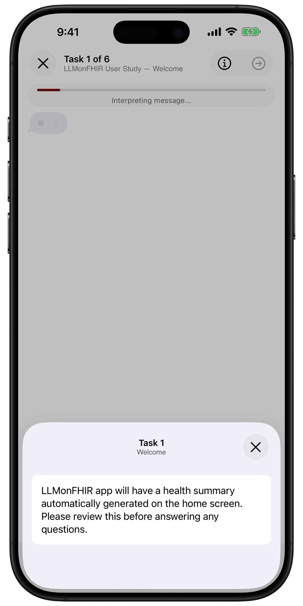

<!--

This source file is part of the Stanford LLM on FHIR project

SPDX-FileCopyrightText: 2023 Stanford University

SPDX-License-Identifier: MIT

-->

# LLM on FHIR - Demystifying Health Records

[](https://github.com/StanfordBDHG/LLMonFHIR/actions/workflows/deployment.yml)
[](https://codecov.io/gh/StanfordBDHG/LLMonFHIR)
[](https://doi.org/10.5281/zenodo.7959850)

<table style="width: 80%">
    <tr>
        <td align="center" width="33.33333%">
            
        </td>
        <td align="center" width="33.33333%">
            
        </td>
        <td align="center" width="33.33333%">
            
        </td>
    </tr>
    <tr>
        <td align="center">Select Multiple Studies</td>
        <td align="center">Study-specific Content</td>
        <td align="center">Task-driven Chat Flows</td>
    </tr>
</table>

## Study Overview

This repository demonstrates how large language models can interpret and provide context around patient data in FHIR format. The LLM on FHIR application is designed as a research study to evaluate the effectiveness of conversational AI in helping users understand their health records.

The study leverages the [Spezi](https://github.com/StanfordSpezi/Spezi) framework and connects to the OpenAI GPT API to interpret FHIR resources. Participants can engage with their health data through a conversational interface, ask follow-up questions, and receive AI-generated summaries and explanations tailored to their system language.

> [!NOTE] 
> Interested in participating? Download LLM on FHIR on your iOS device via [TestFlight](https://testflight.apple.com/join/HBFZ5WOn)!

## Disclaimer

LLM on FHIR is an experimental iOS app. It is designed for general informational purposes, providing users a platform to interact with health records stored in Apple Health using OpenAI models.

- **Not a Substitute for Professional Advice:** LLM on FHIR is not intended as a substitute for professional medical advice, diagnosis, or treatment.

- **Limitations of AI Models:** Remember, AI models can sometimes make mistakes or generate misleading information. Always cross-check and verify the information provided.

- **Use at Your Own Risk:** Any use of LLM on FHIR is at the user's own risk. Always consult a qualified healthcare provider for personalized advice regarding your health and well-being.

- **Demonstration Only:** This app is intended for demonstration only and should not be used to process any personal health information.

Remember that your health data will be sent to OpenAI for processing.
Please inspect and carefully read the [OpenAI API data usage policies and settings](https://openai.com/policies/api-data-usage-policies) accordingly.


## HealthKit Access

LLM on FHIR requires access to the FHIR health records stored in the Apple Health app. You have the control to select the different types of health records you wish to inspect in LLM on FHIR.

In case no health records are available, please follow the instructions to connect and retrieve your health records from your provider. If your health records are visible in the Apple Health app, please ensure that LLM on FHIR has access to your health records in the Apple Health App. You can find these settings in the privacy section of your profile in Apple Health.

> [!TIP]
> You can also use a set of [Synthea](https://doi.org/10.1093/jamia/ocx079)-based patients loaded from [SpeziFHIR](https://github.com/StanfordSpezi/SpeziFHIR) ([SpeziFHIRMockPatients](https://github.com/StanfordSpezi/SpeziFHIR/tree/main/Sources/SpeziFHIRMockPatients)) to test out the application without the need to connect it to HealthKit. You can select the synthetic patients in the account settings view of the application.

## Application Structure

The Spezi Template Application uses a modularized structure using the [Spezi modules](https://swiftpackageindex.com/StanfordSpezi) enabled by the Swift Package Manager.

The application uses the FHIR standard to provide a shared repository for data exchanged between different modules.
You can learn more about the Spezi standards-based software architecture in the [Spezi documentation](https://github.com/StanfordSpezi/Spezi).


## Build and Run the Application

You can build and run the application using [Xcode](https://developer.apple.com/xcode/) by opening up the **LLMonFHIR.xcodeproj**.

When running LLMonFHIR via Xcode, you can use the `--mode` CLI flag to control the behaviour of the app (configurable via the Run scheme):
- `--mode standalone` performs a regular launch, where LLMonFHIR can be used with a custom OpenAI API key to use the chat mode;
- `--mode study:<study-id>` launches LLMonFHIR into its study mode, loads the study with the specified id from the UserStudyConfig.plist file, and automatically opens it;
- `--mode study` launches LLMonFHIR into its study mode, showing a "Scan QR Code" button to select and open a study.


### UserStudyConfig.plist file

LLMonFHIR contains a UserStudyConfig.plist file, which is loaded on launch, and used to configure the app and populate it with studies.
The UserStudyConfig.plist file contains the following:
- Firebase configuration: used, if present, to connect the app to a Firebase environment, which is used to upload study reports
- app launch mode: used to control how the app should behave upon launch (e.g., whether the study-only mode should be enabled, and optionally to also directly launch a study)
- list of available studies (see the `Study` type within the iOS codebase for more details)

The UserStudyConfig.plist file bundled with the repo is missing some data (the OpenAI key, the Firebase credentials, and the study report encryption key).
You can use the `export-config` tool in the LLMonFHIRShared folder to generate a complete config file:
```bash
swift run LLMonFHIRCLI export-config \
    -f ~/GoogleService-Info.plist \
    -o edu.stanford.LLMonFHIR.study1:sk-123 \
    -o edu.stanford.LLMonFHIR.study2:sk-456 \
    -k edu.stanford.LLMonFHIR.study1:./public_key1.pem \
    -k edu.stanford.LLMonFHIR.study2:./public_key2.pem \
    ../LLMonFHIR/Supporting\ Files/UserStudyConfig.plist
```

Some of the flags use a `-x <studyId>:<value>` format and can be specified multiple times, to specify each study's value.
You can also add one entry that uses `*` as the study id, in order to define a default value for all studies not explicitly listed.
(E.g., `-o '*':$OPENAI_KEY` would define the OpenAI key used by all studies that don't have a `-o` entry of their own.)

### Study Report File Encryption

The report files generated form the usability study are optionally encrypted, using the public key stored in UserStudyConfig.plist.

You can generate a public/private key pair using the following commands:
```bash
# generate private key
openssl genpkey -algorithm X25519 -out private_key.pem

# extract public key
openssl pkey -in private_key.pem -pubout -out public_key.pem
```

Use the `export-config` tool showcased above to place your public key in the user study config file:.

In order to decrypt a report file created by the app, you can use the `decrypt-study-report` tool in the LLMonFHIRShared folder:
```bash
swift run LLMonFHIRCLI decrypt-study-report -k private_key.pem studyReport report.json
```


## Network-local privacy-focused Fog LLM Mode

LLMonFHIR can run LLM inference for resource summarization and interpretation on nearby machines in your local network, called fog nodes, instead of only on-device or in the cloud.
The app discovers a fog node via mDNS, connects to it, and streams model responses back while dispatching inference tasks.
This setup provides low latency, strong performance, and improved privacy, since models run on your own hardware inside your own network.

For instructions on running a minimal Docker-based fog node on Linux or macOS, see [FogNode/README.md](FogNode/README.md).


## Session Simulation

The LLMonFHIRShared sub-package contains a tool that allows simulating user chat sessions.

During a simulated chat session, the LLM is provided the same context and data it would be during normal usage of the app, except that the inputs (both the patient's health records, as well as the questions being asked by the user) are pre-defined.
This allows evaluating how different models (or even the same model, across multiple conversations) will handle various scenarios and situations.

For each simulated session, a report file is generated, with the same structure as the report files generated for regular usage sessions in the app.

Session simulation is controled via a JSON config file, which defines the parameters of each session, i.e.:
- the FHIR bundle containing a synthetic patient
    - this can be either the name of a patient in one of the bundles embedded in the LLMonFHIRShared/Resources folder, or a filepath, which will be resolved relative to the location of the config JSON file
- the session's OpenAI model and temperature
- the session's API key
- the study, in whose context the session should take place 
- the specific questions the simulated patient should ask the LLM.

The example config below performs 6 simulated runs of the `edu.stanford.LLMonFHIR.gynStudy` study, 3 each using GPT-4o and GPT-5.2, with each session providing the LLM the exact same data and asking the exact same questions.
```json
[{
    "numberOfRuns": 3,
    "studyId": "edu.stanford.LLMonFHIR.gynStudy",
    "bundleName": "Elena Kim",
    "model": "gpt-4o",
    "temperature": 1,
    "openAIKey": "sk-proj-...",
    "userQuestions": [
        "Tell me about my recent diagnoses and how they affect my fertility.",
        "How are my hormonal levels?",
        "So long and thanls for all the fish!!"
    ]
}, {
    "numberOfRuns": 3,
    "studyId": "edu.stanford.LLMonFHIR.gynStudy",
    "bundleName": "Elena Kim",
    "model": "gpt-5.2",
    "temperature": 1,
    "openAIKey": "sk-proj-...",
    "userQuestions": [
        "Tell me about my recent diagnoses and how they affect my fertility.",
        "How are my hormonal levels?",
        "So long and thanls for all the fish!!"
    ]
}]
```


## Contributors & License

This project is based on [Spezi](https://github.com/StanfordSpezi/Spezi) framework and builds on top of the [Stanford Spezi Template Application](https://github.com/StanfordSpezi/SpeziTemplateApplication) provided using the MIT license.
You can find a list of contributors in the `CONTRIBUTORS.md` file.

The LLM on FHIR project, Spezi Template Application, and the Spezi framework are licensed under the MIT license.
